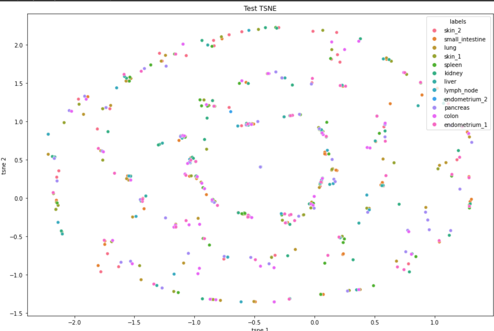

# ML Hiring Test 

The test includes two tasks using computer vision in the field of biomedical imaging data. Of the two tasks, I have picked the Image Classification Task.

Subtasks:
1. Train 2 different models and get results. \
    **a. Download the image classification data.** \
    The data contains a train folder and a test folder, and each folder contains 12 classes and their respective images to be used for the task of image classification. \
    Sample image files after resizing:
    
    
    **b. Train a classification model (using PyTorch or Tensorflow) to classify the tissue images into organ systems they come from.** \
    I created a model from scratch using Tensorflow and used the CNN architechture to build a classification model. \
    **c. Use a pretrained model to create a classification model (using Pytorch or Tensorflow) to classify the tissue images into organ systems they come from.** \
    I used the mobilenet model of tensorflow due to its fast training to perform transfer learning on the current image classification problem. \
    **d. Calculate the training and test accuracy of your model.** 
    1. Results of the model designed from scratch: 
        - The training accuracy of the model peaked at 32% accuracy with 10% validation accuracy. On the test data, the model performed with an accuracy of 11.8%. If the limitations of GPU availablity and time availablity were uplifted following tests could improve the results further:
            - A bigger architechture of the CNN with more successive conv2D layers.
            - Use data augmentation to create new examples as the data is limited. 
            - Perform Batch normalization after each Conv2D layer.
        
        
    2. results of the pretrained model:
        - The results after using the Mobilenet model for transfer learning provided improved results with 89% train accuracy, 80% validation accuracy, and 73% test accuracy.
        - Further steps that can be taken to improve the accuracy:
            - Perform zoom in data augmentation.
            - Try multiple pretrained models with bigger architecture and find a model that best fits the given image classification task. \
         \
         \

2. Visualize:
    - Overlap between training and test datasets in 2D:
     After performing TSNE, the train dataset has a lot of overlap between classes with one exception of "endometrium_2" which is concentrated in at one corner. \
      \
     The test TSNE plot is scattered throughout the plot and there is no visible pattern of classes visible in the plot. \
     

    - Prediction results.
    The pretrained model performs with 70% accuracy on the test dataset. Following is the confusion matrix and the major misclassification \
     \
    Where the classes represent the numbers in the following way: \
    0 skin_2 \
    1 small_intestine \
    2 lung \
    3 skin_1 \
    4 spleen \
    5 kidney \
    6 liver \
    7 lymph_node \
    8 endometrium_2 \
    9 pancreas \
    10 colon \
    11 endometrium_1  \
    Following are the major misclassifications: 
        1. skin_2 and skin_1
        2. lymph_node and spleen
        3. endometrium_1 and endometrium_2

3. Explain why some images might have been classified incorrectly.

4. 1 Page summary on the paper "Deep learning for celluar image analysis" 

The review paper serves as an introduction to deep learning in the field of biomedical imaging techniques. The article focuses on the following critical applications of computer vision in biomedical imaging: image classification, image segmentation, object tracking, and augmented microscopy. Specific softwares have an inbuilt option of providing inference using deep learning in their applications. Still, most life sciences have not leveraged the power of deep learning on their data to gather groundbreaking insights. There are a few reasons why researchers may still not have adapted deep learning models in their research areas. There is a barrier to entry to apply deep learning models on the existing data of the researchers, and the current review paper aims to inform the researchers about them and how they can overcome such barriers. One of the most important tasks of creating a machine learning pipeline is the need to annotate the data based on the problem we want to solve. E.g., they label the image classes for image classification and provide essential areas for images to perform image segmentation. The problem is solved by creating open source datasets, and the research community can help in annotating the datasets. Other solutions include gamification of the annotation process, using active learning models using semi-supervised learning. A lot of the time, the data present with the researchers is not large enough to design a robust model. We can either perform data augmentation or image normalization to solve these issues. A lot of research has been done on creating generalized deep neural networks that extract the minute feature intricacies of the dataset, which researchers can use with the concept of transfer learning. Researchers can customize the first and the last layer of these pre-trained models and apply them to their custom projects. No access to GPUs at a large scale and no prior knowledge of software coding skills and shell scripting also create a barrier for researchers to scale their projects on a large scale. But the review paper provides resources for the reader to learn the skills quickly or use softwares by other companies. The paper also delves deeper into the mathematical terms of the deep learning models and the general jargon used while creating a machine learning model. The article specifies the concepts of forward propagation and backward propagation in neural networks and components such as hidden layers, covolutional layers, activation function, etc. Although the reader is expected to understand the terminology and the maths behind the much perceived “black-box” deep learning models, there are already libraries created in Python and MATLAB so that researchers can work on building architectures that improve accuracy and not get overwhelmed by applying the mathematics every time they work on building a model. After providing a short review of the terminology about deep learning, the paper talks about the applications of computer vision using deep learning models in biomedical imaging. It provides resources for further reading on the topics.

    
